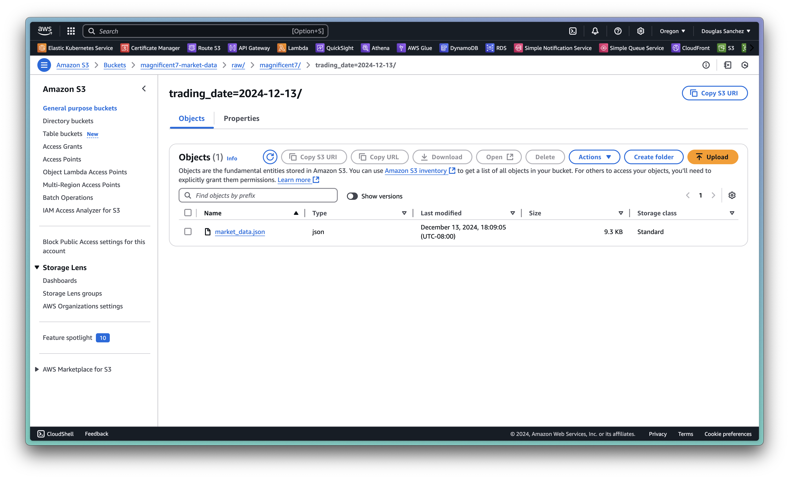
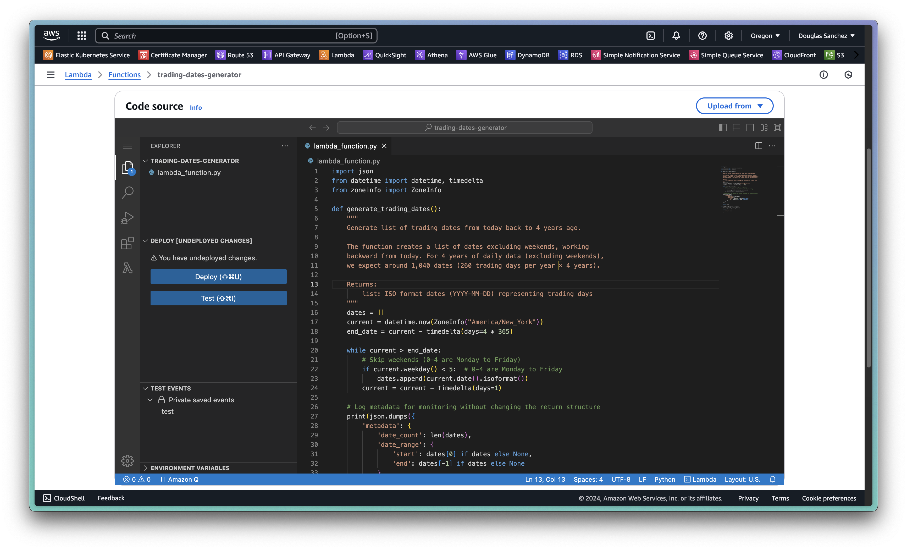

# Magnificent 7 Market Concentration Analysis Pipeline

## Project Overview
This project implements a cloud-native data pipeline on Amazon Web Services (AWS) that tracks and analyzes the market concentration of the Magnificent 7 technology companies (Apple, Microsoft, Alphabet, Amazon, Nvidia, Meta, and Tesla) relative to the broader S&P 500 index. The pipeline collects historical market data, processes it for analysis, and makes it available for visualization through a series of automated AWS services. The goal is to help investors understand their true portfolio exposure through passive investments in ETFs that track the S&P 500.

## Project Videos
- [2-3 minute YouTube Summary]()
- [8+ minute YouTube Presentation]()

## Repository Structure
```plaintext
mags/
├── README.md                               # Project overview and main documentation
├── architecture/                           # Architecture diagrams
│   ├── architecture.mermaid                # Architecture diagram in Mermaid format
│   └── architecture.png                    # Architecture diagram image
├── data/                                   # Data files for S&P 500 constituent companies
│   ├── IVV_holdings.csv                    # iShares Core S&P 500 ETF (IVV) Detailed Holdings and Analytics
│   └── market_data.json                    # Raw data from raw/magnificent7/trading_date=2024-12-13/
└── services/                               # AWS Services
    ├── athena/                             # Athena queries for data validation and insights
    │   ├── all_magnificent7.sql            # Query to fetch Magnificent 7 data
    │   ├── earliest_latest_date.sql        # Query for earliest and latest trading dates
    │   ├── market_cap_extremes.sql         # Query for market cap extremes
    │   └── min_max_concentration.sql       # Query for concentration metrics
    ├── cloudshell/                         # CloudShell scripts for S&P 500 ticker preparation
    │   ├── filter_equity_tickers.py        # Python script to filter equity tickers
    │   └── output/                         # Output files from CloudShell scripts
    │       ├── filtered_tickers.csv        # Filtered list of equity tickers
    │       └── tickers_array.py            # Python array of filtered tickers
    ├── glue/                               # Glue SQL transformations
    │   ├── company_detail.sql              # Transformation for company details
    │   ├── concentration_metrics.sql       # Transformation for concentration metrics
    │   ├── daily_trading.sql               # Transformation for daily trading data
    │   ├── failed_collections.sql          # Transformation for failed data collections
    │   └── magnificent7_metrics.sql        # Transformation for Magnificent 7 metrics
    ├── lambda/                             # Lambda functions for data collection
    │   ├── magnificent7-historical-data-collector/     # Collector for historical Magnificent 7 data
    │   │   ├── layer/                      # Layer for dependencies
    │   │   │   └── python.zip              # Python dependencies
    │   │   └── lambda_function.py          # Main Lambda function
    │   ├── trading-dates-generator/        # Generator for trading dates
    │   │   └── lambda_function.py          # Main Lambda function
    │   └── trading-dates-generator-range/  # Generator for trading date ranges
    │       └── lambda_function.py          # Main Lambda function
    ├── quicksight/                         # QuickSight visualizations and configurations
    ├── redshift/                           # Redshift data warehouse scripts
    │   ├── copy_jobs.ipynb                 # Jupyter notebook for Redshift copy jobs
    │   ├── schema_definition.sql           # SQL script for schema definitions
    │   ├── table_definitions.ipynb         # Jupyter notebook for table definitions
    └── step-functions/                     # Step Function state machine definitions
        ├── historical-data-collection/     # Historical data collection state machine
        │   └── code.json                   # State machine definition
        └── historical-data-collection-missing-data/  # Missing data collection state machine
            └── code.json                   # State machine definition
```

## Architecture Overview


### Service Architecture
The platform implements a serverless event-driven architecture that collects, processes, and analyzes stock market data through several AWS services. The system is divided into four main components:

1. Storage Layer
   - **Amazon S3 (Data Lake)**
     - Raw (semi-structured) data landing zone for market data
     - Processed (structured) data storage for analytics
     - Partitioned by date and data type
     - Follows a multi-zone architecture (raw, processed, analytics)

2. Data Collection Layer
   - **AWS Lambda**
     - Daily market data collection
     - Historical data backfill capabilities
     - Error handling and retry logic
     - Rate limiting and API quota management
   
   - **AWS Step Functions**
     - Orchestrates data collection workflows
     - Manages state transitions and error handling
     - Coordinates multiple Lambda executions
     - Implements retry and backoff strategies

3. Data Processing Layer
   - **AWS CloudShell**
     - Initial data cleaning and preparation
     - Ticker symbol validation
     - Ad-hoc data manipulation tasks
     - Script execution environment

   - **AWS Glue**
     - ETL job management and scheduling
     - Data catalog maintenance
     - Schema evolution handling
     - Data quality validation

4. Analytics Layer
   - **Amazon Athena**
     - SQL-based data validation
     - Ad-hoc analysis capabilities
     - Data quality checks
     - Performance monitoring queries

   - **Amazon Redshift**
     - Central data warehouse
     - Complex analytical queries
     - Historical trend analysis
     - Performance optimization

   - **Amazon QuickSight**
     - Interactive dashboards
     - Metric visualization
     - Custom analysis views
     - Automated reporting

### Data Flow
1. Collection Process
   - CloudShell prepares API data targets
   - Step Functions trigger Lambda functions on schedule
   - Lambda collects market data from external APIs
   - Raw data stored in S3 landing zone
   - Failed collections logged for retry

2. Processing Pipeline
   - Glue jobs transform raw data into analytical formats
   - Data quality validated through Athena queries
   - Processed data loaded into Redshift

3. Analytics Workflow
   - Redshift powers complex analytical queries
   - QuickSight consumes Glue Data Catalog data for visualizations
   - Custom analyses and dashboards track Magnificent 7 concentration
   - Share insights with data stories

## Prerequisites

### AWS Account with Administrative Access
This project was created in an AWS Root Account with administrative access. Ensure you have administrative access to the services described in the Service Architecture. Resource policies as well as user and service IAM roles may need to be modified for not root users.

### Supported Region
Modern data analytics workflows prioritize rapid insight generation through visualizations. Since Amazon QuickSight is central to our visualization strategy, deploy all resources in a single QuickSight-supported region. This pipeline uses **US West (Oregon) (us-west-2)**.

Reference: [QuickSight Supported Regions](https://docs.aws.amazon.com/quicksight/latest/user/regions-qs.html)

### Polygon.io API Setup
This project requires a Polygon.io Stocks Starter subscription for market data collection. Each Lambda function makes 500+ API calls per trading day, exceeding the Basic tier's 5 calls/minute limit.


#### Setup Steps
1. Create account: [Polygon.io Signup](https://polygon.io/dashboard/signup)
2. Subscribe to Stocks Starter tier
3. Get API key: [Dashboard](https://polygon.io/dashboard/keys)

Save the API key for future use as the `POLYGON_API_KEY` Lambda environment variable.

Example API key format:
```json
_eaBY7FrBg2jiHB2PM63CY7HUgyQLtLf
```

## Collection Process

### S&P 500 Constituent Data Collection
The analysis compares Magnificent 7 market caps against the S&P 500 index. Since S&P Dow Jones Indices data is proprietary, we use BlackRock's IVV ETF holdings (December 12th, 2024) as our constituent data source. While the constituents of the S&P 500 are always changing, we will use this point in time holdings data to simplify our analysis.


#### Data Source
For IVV ETF details and documentation: [IVV ETF Overview](https://www.ishares.com/us/products/239726/ishares-core-sp-500-etf)

Detailed Holdings and Analytics: [IVV Holdings CSV](https://www.ishares.com/us/products/239726/ishares-core-sp-500-etf/1467271812596.ajax?fileType=csv&fileName=IVV_holdings&dataType=fund)  

[IVV_holdings.csv](data/IVV_holdings.csv)
```csv
iShares Core S&P 500 ETF
Fund Holdings as of,"Dec 06, 2024"
Inception Date,"May 15, 2000"
Shares Outstanding,"957,950,000.00"
Stock,"-"
Bond,"-"
Cash,"-"
Other,"-"
 
Ticker,Name,Sector,Asset Class,Market Value,Weight (%),Notional Value,Quantity,Price,Location,Exchange,Currency,FX Rate,Market Currency,Accrual Date
"AAPL","APPLE INC","Information Technology","Equity","41,700,670,815.44","7.15","41,700,670,815.44","171,720,766.00","242.84","United States","NASDAQ","USD","1.00","USD","-"
"NVDA","NVIDIA CORP","Information Technology","Equity","39,575,685,429.36","6.79","39,575,685,429.36","277,841,094.00","142.44","United States","NASDAQ","USD","1.00","USD","-"
"MSFT","MICROSOFT CORP","Information Technology","Equity","37,238,281,689.56","6.38","37,238,281,689.56","83,951,308.00","443.57","United States","NASDAQ","USD","1.00","USD","-"
"AMZN","AMAZON COM INC","Consumer Discretionary","Equity","23,951,910,419.43","4.11","23,951,910,419.43","105,501,081.00","227.03","United States","NASDAQ","USD","1.00","USD","-"
...
```

### Data Preparation with CloudShell
Use AWS CloudShell to extract equity ticker symbols from `IVV_holdings.csv` using Python. This ensures accurate data handling by removing non-equity holdings and extraneous data through automation. CloudShell provides a pre-configured environment with AWS CLI and Python, eliminating setup requirements and ensuring consistent execution.


#### Steps to run the data cleaning script in AWS CloudShell
1. **Upload the CSV file**
    - Open **AWS CloudShell** in the AWS Management Console.
    - Use the **"Upload File"** option in CloudShell to upload the `IVV_holdings.csv` file into your working directory.

2. **Upload the Python file**
    - Use the **"Upload File"** option in CloudShell to upload the `filter_equity_ticker.py` file into your working directory.

    [filter_equity_ticker.py](services/cloudshell/filter_equity_tickers.py)
    ```python
    import pandas as pd

    # File path for the input CSV
    file_path = 'IVV_holdings.csv'

    # Read the raw content of the file to inspect structure
    with open(file_path, 'r') as file:
        raw_content = file.readlines()

    # Identify the start of actual data (header line)
    header_line_index = next(
        (index for index, line in enumerate(raw_content) if "Ticker,Name," in line), None
    )
    ...
    ```


3. **Install Dependencies**
    - Install `pandas` in the CloudShell environment:
    ```bash
    pip3 install pandas --user
    ```

4. **Run the Script**
    - Run the Python script in CloudShell:
    ```bash
    python3 filter_equity_tickers.py
    ```

5. **Download the Results**
    - After the script runs successfully, you will have two output files:
        - [filtered_ticker.csv](services/cloudshell/output/filtered_tickers.csv)
        - [tickers_array.py](services/cloudshell/output/tickers_array.py)
        ```python
        tickers = ['AAPL', 'NVDA', 'MSFT', 'AMZN', 'META', 'TSLA', 'GOOGL', 'BRKB', 'GOOG', 'AVGO', 'JPM', 'LLY', 'V', 'UNH', 'XOM', 'COST', 'MA', 'HD', 'WMT', 'PG', 'NFLX', 'JNJ', 'CRM', 'BAC', 'ABBV', 'ORCL', 'CVX', 'MRK', 'WFC', 'ADBE', 'KO', 'CSCO', 'NOW', 'ACN', 'AMD', 'IBM', 'PEP', 'LIN', 'MCD', 'DIS', 'PM', 'TMO', 'ABT', 'ISRG', 'CAT', 'GE', 'GS',
        ... 
        ```
    - Use the **"Download File"** option in CloudShell to download these files to your local machine.
    
Note: We will use the `tickers_array.py` code in our data collection Lambda function.

### Data Lake Implementation with Amazon S3
S3 bucket needs to store historical stock data, requiring a structure that supports efficient querying and maintains data organization. Here's a detailed walkthrough.


1. S3 Bucket Creation
    - Go to **S3** in the AWS Console. Make sure you are in the QuickSight supported region you choose earlier.
    - Click **"Create bucket"**.
    - For **"Bucket name"** enter "magnificent7-market-data".
    - Enable **"Bucket Versioning"** to safe guard against duplicate files.
    - Click **"Create bucket"**.
2. Bucket directory structure
    - Click on the bucket name you just created from the **"General purpose buckets"** table.
    - Use the **"Create folder"** button to create the following bucket structure:
    ```plaintext
    magnificent7-market-data/
    ├── raw/
    │   └── magnificent7/
    ├── processed/
    │   ├── concentration_metrics/
    │   ├── company_details/
    │   ├── daily_trading/
    │   ├── magnificent7_metrics/
    │   └── failed_collections/
    └── analytics/
        ├── concentration_metrics/
        ├── company_details/
        ├── daily_trading/
        ├── magnificent7_metrics/
        └── failed_collections/
    ```
    - This structure uses partitioning by date, which helps with data organization and query performance.

3. Edit Bucket Policy
    - Click on the Permission tab and scroll down to Bucket policy.
    - Click "Edit" and paste the following policy to allow access from any authenticated service within your AWS account.
    ```json
    {
        "Version": "2012-10-17",
        "Statement": [
            {
                "Sid": "AllowAWSServiceAccess",
                "Effect": "Allow",
                "Principal": {
                    "AWS": "arn:aws:iam::ACCOUNT-ID:root"
                },
                "Action": [
                    "s3:GetObject",
                    "s3:PutObject",
                    "s3:ListBucket"
                ],
                "Resource": [
                    "arn:aws:s3:::magnificent7-market-data",
                    "arn:aws:s3:::magnificent7-market-data/*"
                ],
                "Condition": {
                    "StringEquals": {
                        "aws:PrincipalAccount": "ACCOUNT-ID"
                    }
                }
            }
        ]
    }
    ```


### Historical Data Collection with AWS Lambda
The data collection process is implemented using two AWS Lambda functions: one to collect market data and another to generate trading dates.


#### Market Data Collector Lambda Function
The Market Data Collector function serves as the core component of our data pipeline, retrieving and processing daily market data from Polygon.io. The function implements a stateless architecture, processing one trading day per execution to ensure reliability and simplify error handling.

The function executes a carefully orchestrated sequence of API calls to gather comprehensive market data. It begins by collecting S&P 500 constituent data, then focuses on the Magnificent 7 companies. To manage API rate limits effectively, the function implements a controlled delay between requests, preventing throttling while maintaining efficient data collection.

[magnificent7-historical-data-collector/lambda_function.py](services/lambda/magnificent7-historical-data-collector/lambda_function.py)
```python
from polygon import RESTClient
import json
import os
import boto3
from datetime import datetime, timedelta
from zoneinfo import ZoneInfo
import time

def get_previous_trading_date():
    """
    Determines the most recent trading day, accounting for weekends.
    This function ensures we don't request data for non-trading days.
    
    Returns:
        str: Date in YYYY-MM-DD format representing the last trading day
    """
...
```

The function implements a date-partitioned storage strategy in Amazon S3, organizing data for optimal query performance:
```plaintext
s3://magnificent7-market-data/
└── raw/
    └── magnificent7/
        └── trading_date=YYYY-MM-DD/
            └── market_data.json
```


#### Steps to create historical data collection
1. **Create Lambda function**
    - Go to **Lambda** in the AWS Console.
    - Click **"Create function"**.
    - Choose **"Author from scratch"**.
    - Enter "magnificent7-historical-data-collector" for the **Function name**.
    - Select "Python 3.13" for "Runtime".
    - Leave other configurations as is.
    - Click on **"Create function"**.
2. **Configure Lambda function**
    - After the function is successfully created you will be taken to the function details page. Click on the **"Configuration"** tab below the **"Function overview"**.
    - Within **"General configuration"** click **"Edit**" and add the update the following values:
    ```yaml
    Memory: 512 MB
    Timeout: 15 min 0 seconds (maximum)
    ```
    - Click **"Save"**.
    - Within **"Environment variables"** click **"Edit**". Then click **"Add environment variable"** and add the update the following values:
    ```yaml
    POLYGON_API_KEY: [API Key]
    DATA_BUCKET: [S3 Bucket Name]
    ```
    - Click **"Save"**.
3. Configure Lambda IAM Role
    - Within "Permissions" click the Role name under "Execution role" to open the IAM console.
    - Add these policies:
        - AWSLambdaBasicExecutionRole (should already be there)
        - S3 access policy 
            - Create a custom policy for S3 access, click "Add permission" and select "Create inline policy"
            - Click "JSON" in the Policy editor
            - Paste the following statement:
            ```json
            {
                "Version": "2012-10-17",
                "Statement": [
                    {
                        "Effect": "Allow",
                        "Action": [
                            "s3:PutObject",
                            "s3:GetObject",
                            "s3:ListBucket"
                        ],
                        "Resource": [
                            "arn:aws:s3:::magnificent7-market-data/*",
                            "arn:aws:s3:::magnificent7-market-data"
                        ]
                    }
                ]
            }
            ```
            - Click "Next" and input a descriptive Policy name like "S3AccessPolicyMag7". We will reuse this policy and add it to all our services needing permissions to access our Magnificent 7 market data.
            - Click "Create policy". The policy wil be created and added to the service role attached to your Lambda function.
4. Creat a Lambda layer
    - Since we're using external libraries, we need to create a Lambda layer to install required dependencies. Go to "CloudShell".
    - Create a new directory on your local machine called "python".
    ```bash
    mkdir python
    ```
    - Run the following script to install the dependencies. If you get an error you can ignore it. We won't be utilizing the libraries within Cloudshell.
    ```bash
    pip3 install polygon-api-client pandas-market-calendars -t python/
    ```
    - Zip the "python" folder.
    ```bash
    zip -r python.zip python/
    ```
    - Use the **"Download File"** option in CloudShell to download the [python.zip](services/lambda/magnificent7-historical-data-collector/layer/python.zip) file to your local machine.

    

    - In Lambda console, go to "Layers".
    - Click "Create layer".
    - Name the layer and upload the zipped file.
    - Select "Python 3.13" for the Compatabile runtime.
    - Click "Create".
5. Add the layer to the Lambda function
    - Go to the "magnificent7-historical-data-collector" function details page.
    - Click the "Code" tab and scroll down to Layers.
    - Click "Add a layer".
    - Choose "Custom layers" and select the custom layer you just created.
    - Click "Add".
6. **Add Lambda function code**
    - Click on the **"Code"** tab below the **"Function overview"**.
    - In **"Code source"** add the code from `magnificent7-historical-data-collector/lambda_function.py`

    

    - Click **"Deploy"** to save the function.

#### Steps to test historical data collection
1. **Create a test event**
    - Next click **"Test"**, then **"Create new test event"**.
    - Add an **"Event Name"** and enter an empty **"Event JSON"**
    ```json
    {}
    ```
    - Click **"Save"**.
    - Run the test by clicking **"Test"** and selecting the test you named from the editor Command Palette.
2. **Verify data was saved in S3**
    - Monitor the editor "OUTPUT" for a "Status: Succeeded" to ensure that there were no errors in your function code.
    - Navigate to your S3 bucket "magnificent7-market-data".
    - Look for path: raw/magnificent7/trading_date=YYYY-MM-DD/market_data.json

    

    - Open the `market_data.json` file and validate that the data matches the intented structure and is complete. Compare it to [data/market_data.json](data/market_data.json).

[market_data.json](data/market_data.json)
```json
{
  "trading_date": "2024-12-13",
  "data_collection_time": "2024-12-13T20:59:05.268375-05:00",
  "companies": {
    "AAPL": {
      "name": "Apple Inc.",
      "market_cap": 3750689160990.0,
      "shares_outstanding": 15115823000,
      "currency": "usd",
      "description": "Apple is among the largest companies in the world, with a broad portfolio of hardware and software products targeted at consumers and businesses. Apple's iPhone makes up a majority of the firm sales, and Apple's other products like Mac, iPad, and Watch are designed around the iPhone as the focal point of an expansive software ecosystem. Apple has progressively worked to add new applications, like streaming video, subscription bundles, and augmented reality. The firm designs its own software and semiconductors while working with subcontractors like Foxconn and TSMC to build its products and chips. Slightly less than half of Apple's sales come directly through its flagship stores, with a majority of sales coming indirectly through partnerships and distribution.",
      "trading_data": {
...
```

The function organizes collected data into a hierarchical JSON structure that facilitates downstream analysis. If the data is there, we can proceed to collect data for the last four years. 


### Trading Date Generator Lambda Function
The Trading Date Generator function creates lists of valid market trading dates, serving as a critical component for orchestrating historical data collection. This function can generate either a complete trading history for the past four years or a specific date range as needed.



##### Implementation Steps
1. **Create the Lambda Function**
   - Navigate to the AWS Lambda console and create a new function:
   ```yaml
   Function Name: trading-dates-generator
   Runtime: Python 3.13
   Architecture: x86_64
   Permissions: Create new role with basic Lambda permissions
   Memory: 128 MB (default)
   Timeout: 3 minutes
   ```
2. **Deploy Function Code**
    - Paste the following function code into the text editor and Deploy the changes.

        [trading-dates-generator/lambda_function.py](services/lambda/trading-dates-generator/lambda_function.py)
        ```python
        import json
        from datetime import datetime, timedelta
        from zoneinfo import ZoneInfo

        def generate_trading_dates():
            """
            Generate list of trading dates from today back to 4 years ago.
            
            The function creates a list of dates excluding weekends, working
            backward from today. For 4 years of daily data (excluding weekends),
            we expect around 1,040 dates (260 trading days per year × 4 years).
            
            Returns:
                list: ISO format dates (YYYY-MM-DD) representing trading days
            """
            ...
        ```


### Orchestration with AWS Step Functions

AWS Step Functions provides the orchestration layer for our historical data collection pipeline, managing the execution flow between our Lambda functions. This serverless workflow engine ensures reliable data collection across extended time periods while providing robust error handling and execution visibility.


#### Core Architecture Components
A Step Functions state machine coordinates the workflow through two key Lambda functions:

1. Trading Dates Generator: Creates a list of valid market trading dates
2. Market Data Collector: Retrieves market data for each trading date

The state machine implements a Map state pattern, processing dates either sequentially or in parallel based on configuration. This design ensures both reliability and scalability while maintaining precise control over API rate limits.

#### Step Functions State Machine Creation
To create the state machine that orchestrates our data collection workflow, follow these detailed implementation steps.

1. Navigate to the AWS Step Functions Console
   - Select "State machines" from the left navigation
   - Click "Create state machine"
   - Choose "Write workflow in code" for the authoring method
   - Select "Standard" for the state machine type

2. Define the State Machine Logic
   
    - Copy the following state machine defintion into the code editor, then save the state machine.

    [historical-data-collection/code.json](services/step-functions/historical-data-collection/code.json)
    ```json
    {
    "Comment": "Historical Data Collection Workflow",
    "StartAt": "GenerateDates",
    "States": {
      "GenerateDates": {
        "Type": "Task",
        "Resource": "arn:aws:lambda:us-west-2:371484867872:function:trading-dates-generator",
        "Next": "ProcessDates"
      },
      "ProcessDates": {
        "Type": "Map",
        "ItemsPath": "$.dates",
        "MaxConcurrency": 10,
    ...
    ```

#### IAM Role Configuration for Step Functions

The Step Functions state machine requires specific IAM permissions to invoke the Lambda functions in our workflow. We'll configure these permissions through the AWS IAM Console.

Navigate to the IAM console and locate the role that was automatically created when you set up the state machine. The role name typically follows the pattern `StepFunctions-HistoricalDataCollection-Role-[Random String]`.

First, verify the base role configuration:

The role should already include the basic Step Functions execution policy (`AWSStepFunctionsFullAccess`). We need to add specific Lambda invocation permissions for our functions.

Create a new inline policy for Lambda invocation permissions:

1. In the IAM console, select the Step Functions role
2. Navigate to the "Add permissions" dropdown and select "Create inline policy"
3. Choose the JSON editor and enter the following policy document:

```json
{
    "Version": "2012-10-17",
    "Statement": [
        {
            "Effect": "Allow",
            "Action": [
                "lambda:InvokeFunction"
            ],
            "Resource": [
                "arn:aws:lambda:us-west-2:ACCOUNT-ID:function:trading-dates-generator",
                "arn:aws:lambda:us-west-2:ACCOUNT-ID:function:magnificent7-historical-data-collector"
            ]
        }
    ]
}
```

#### Executing the State Machine
After configuring your state machine, you can initiate the historical data collection process through the AWS Step Functions console. The execution will coordinate between the date generator and data collector functions to systematically gather market data.

Navigate to the AWS Step Functions console and select your "historical-data-collection" state machine. Click "Start execution" to begin the process. For a complete historical data collection covering the past four years, you can use an empty JSON object as the input:

```json
{}
```

#### Monitoring the Execution
The Step Functions console provides a visual representation of your workflow execution. The process unfolds in several stages:


First, the date generator Lambda function executes, producing a list of valid trading dates. You'll see this represented in the "GenerateTradingDates" state, typically completing within seconds.

Next, the "ProcessTradingDates" Map state begins processing the date list. With the MaxConcurrency parameter set to 10, the workflow processes ten dates simultaneously. The console displays a progress indicator showing the percentage of completed executions.
Each date processing task appears as a separate execution branch, with real-time status updates indicating success or failure. The visual interface makes it easy to identify any issues that require attention.

#### Performance Considerations
The complete data collection process for four years of historical data requires significant execution time. With each Lambda function taking approximately 9 minutes to process a single date, and considering the 15-minute Lambda timeout limit, the entire workflow typically requires about 15 hours to complete with MaxConcurrency set to 10.

#### Recovery Process
In the event that your state machine encounters errors or fails to complete, a separate recovery workflow is available. This alternative implementation uses [trading-dates-generator-range/lambda_function.py](services/lambda/trading-dates-generator-range/lambda_function.py). This allows you to target specific date ranges for data collection.

[trading-dates-generator-range/lambda_function.py](services/lambda/trading-dates-generator-range/lambda_function.py)
```python
import json
from datetime import datetime, timedelta
from zoneinfo import ZoneInfo

def generate_trading_dates():
    """
    Generate list of trading dates from a range.
    
    The function creates a list of dates excluding weekends from a range based on inputs.
    
    Returns:
        list: ISO format dates (YYYY-MM-DD) representing trading days
    """
    ...
```

To implement the recovery workflow:
1. Create a new lambda function and new state machine following the same steps outlined previously.
2. Use the modified state machine definition that references the trading-dates-generator-range Lambda function.

    [historical-data-collection-missing-data/code.json](services/step-functions/historical-data-collection-missing-data/code.json)
    ```json
    {
    "Comment": "Historical Data Collection Workflow - Missing Dates",
    "StartAt": "GenerateDates",
    "States": {
      "GenerateDates": {
        "Type": "Task",
        "Resource": "arn:aws:lambda:us-west-2:371484867872:function:trading-dates-generator-range",
        "Next": "ProcessDates"
      },
      "ProcessDates": {
        "Type": "Map",
        "ItemsPath": "$.dates",
        "MaxConcurrency": 10,
    ```
3. Provide the specific date range where data collection needs to be repeated in the lambda function code.

This recovery mechanism ensures you can efficiently address any gaps in your historical data collection without reprocessing the entire date range.

## Processing Pipeline

### AWS Glue Data Catalog Configuration

The processing pipeline leverages AWS Glue to transform our raw JSON market data into optimized formats for both analysis and storage. This approach creates two distinct data paths: one optimized for Athena queries through partitioned Parquet files, and another designed for efficient Redshift loading using unpartitioned Parquet files.


#### Data Transformation Strategy

AWS Glue serves as our primary transformation engine, handling the complexity of processing nested JSON structures into analytics-ready formats. The transformation process addresses several key requirements:

First, Glue flattens our nested JSON structures into normalized table formats, making the data more accessible for analysis. This process splits the complex JSON structure into discrete tables that align with our analytical needs while maintaining the relationships between different data elements.

Second, the transformation converts our data into the Parquet columnar format, which provides significant performance benefits for both storage and querying. Parquet's columnar structure is particularly well-suited for analytical workloads, allowing for efficient compression and faster query execution.

#### Dual Pipeline Architecture

Our processing pipeline implements a dual-path strategy to optimize for different analytical needs:

For Athena-based analytics, we create partitioned Parquet files organized by trading date. This structure enables Athena to leverage partition pruning, significantly reducing the amount of data scanned during queries and improving query performance while minimizing costs.

For Redshift integration, we generate unpartitioned Parquet files. This approach aligns with Redshift's native distribution mechanisms, allowing the data warehouse to manage data distribution according to its own optimization strategies.

The processing flow follows this sequence:

1. Raw JSON Processing
   - Source data is read from S3 in its original JSON format
   - The nested structure is parsed and validated
   - Data is transformed into normalized table structures

2. Athena-Optimized Path
   - Data is partitioned by trading date
   - Parquet files are generated with partition structure
   - The Glue Data Catalog is updated to reflect the partitioned schema

3. Redshift-Optimized Path
   - Data is transformed into unpartitioned Parquet files
   - Files are organized for efficient Redshift COPY operations
   - The structure aligns with Redshift's distribution strategy

#### Benefits of Implementation

This dual-pipeline approach delivers several significant advantages. The partitioned structure for Athena enables efficient query execution through partition pruning, while the unpartitioned format for Redshift allows the data warehouse to optimize data distribution according to its internal mechanisms.

The transformation to Parquet format provides enhanced compression, reducing storage costs and improving query performance. The simplified data structure also makes maintenance and troubleshooting more straightforward, as the data is organized in a clear, logical manner.

The use of AWS Glue as our transformation engine provides robust error handling and monitoring capabilities, ensuring data quality and completeness throughout the processing pipeline. The resulting data structures are both performant and maintainable, setting a strong foundation for our analytical workloads.

### Creating the Glue Data Catalog Database

The AWS Glue Data Catalog serves as a central metadata repository for our market data assets. Creating a dedicated database in the Data Catalog establishes an organized foundation for our data processing pipeline. The database will store table definitions and schemas that our ETL jobs will populate.


#### Database Creation Process

1. Navigate to the AWS Glue console and locate the Data Catalog section in the left navigation panel. 
2. Select "Databases" to access the database management interface. 
3. From here, create a new database by selecting "Add database."
4. Enter "market_data" as the name.

At this stage, we will not create any tables within the database, as our ETL job will generate these automatically based on our data structure.

The database will eventually contain table definitions for:
- Concentration metrics tracking market cap distributions
- Company details storing fundamental information
- Daily trading data capturing price movements
- Magnificent 7 specific metrics
- Data collection status information

Our ETL job will create these table definitions dynamically during its first run, ensuring that the schemas precisely match our transformed data structure. This approach maintains consistency between our data and metadata while reducing manual configuration requirements.

### Glue ETL Job Development

The ETL job transforms our raw JSON market data into optimized Parquet files while maintaining data integrity and relationships. We'll use Glue's visual interface to configure the transformation pipeline, implementing SQL-based transformations for each target table. Our data processing strategy requires two separate ETL jobs to optimize data for different analytical use cases. We'll create a processing pipeline for Athena queries and an analytics pipeline for Redshift integration.


#### Creating the ETL Jobs

Navigate to the AWS Glue console and select "ETL jobs" from the left navigation panel. Create a new job by clicking "Create job" and selecting "Visual with a source and target" as the job type. Name the job optimized for Athena queries "processing-pipeline" to reflect its purpose. Name the job optimized for Redshift loading "analytics-pipeline" to reflect its purpose.

#### Source Configuration

Begin by configuring the data source for our ETL pipeline. Select Amazon S3 as the source type and specify the following parameters:

Source Configuration:
- Data Format: JSON
- S3 URL Path: s3://magnificent7-market-data/raw/magnificent7/
- Enable Schema Inference: Yes

After configuring the source, click "Infer schema" to allow Glue to analyze our JSON structure. This automatic schema inference provides the foundation for our transformations.

#### Schema Modification

Add a Change Schema node to review and modify the inferred schema. This step is crucial for ensuring proper data type handling in our transformations. Within the schema editor:

1. Locate the Companies array in the schema
2. For each company entry, modify the following fields:
   - market_cap: Change to DOUBLE
   - shares_outstanding: Change to DOUBLE

These modifications ensure accurate numerical processing in our subsequent SQL transformations.

#### Transformation Implementation

Create separate transformation branches for each target table. Each branch should originate from the Change Schema node, implementing specific SQL transformations for its target table.

Create SQL transformation nodes for:
1. Concentration Metrics: Market-wide concentration analysis

[concentration_metrics.sql](services/glue/concentration_metrics.sql)
```sql
SELECT 
    -- Get trading_date from root level for consistency
    trading_date,
    -- Extract fields from concentration_metrics structure
    concentration_metrics.total_mag7_market_cap,
    concentration_metrics.sp500_total_market_cap,
    concentration_metrics.mag7_pct_of_sp500,
    concentration_metrics.mag7_companies_count
FROM myDataSource
WHERE concentration_metrics.total_mag7_market_cap IS NOT NULL
```

2. Company Details: Fundamental company information

[company_details.sql](services/glue/company_details.sql)
```sql
SELECT 
    trading_date,
    stack(7,
        'AAPL', companies.AAPL.name, 
        CAST(companies.AAPL.market_cap AS DOUBLE),
        CAST(companies.AAPL.shares_outstanding AS DOUBLE),
        companies.AAPL.currency, 
        companies.AAPL.description,

        'MSFT', companies.MSFT.name, 
        CAST(companies.MSFT.market_cap AS DOUBLE),
        CAST(companies.MSFT.shares_outstanding AS DOUBLE),
        companies.MSFT.currency, 
        companies.MSFT.description,
        ...
```

3. Daily Trading: Price and volume data

[daily_trading.sql](services/glue/daily_trading.sql)
```sql
SELECT 
    -- Get trading date from the nested trading_data to match the actual trading day
    companies.AAPL.trading_data.date AS trading_date,
    -- Use stack to transform company trading data into rows
    stack(7,
        'AAPL', companies.AAPL.trading_data.open_price, companies.AAPL.trading_data.high_price, companies.AAPL.trading_data.low_price, companies.AAPL.trading_data.close_price, companies.AAPL.trading_data.volume, companies.AAPL.trading_data.vwap,
        'MSFT', companies.MSFT.trading_data.open_price, companies.MSFT.trading_data.high_price, companies.MSFT.trading_data.low_price, companies.MSFT.trading_data.close_price, companies.MSFT.trading_data.volume, companies.MSFT.trading_data.vwap,
        ...
```

4. Magnificent 7 Metrics: Specific metrics for our focus companies

[magnificent7_metrics.sql](services/glue/magnificent7_metrics.sql)
```sql
SELECT
    trading_date,
    -- Extract from the rankings.by_market_cap array which is already ordered
    stack(7,
        rankings.by_market_cap[0].ticker, rankings.by_market_cap[0].market_cap, rankings.by_market_cap[0].pct_of_mag7, rankings.by_market_cap[0].pct_of_sp500, 1,
        rankings.by_market_cap[1].ticker, rankings.by_market_cap[1].market_cap, rankings.by_market_cap[1].pct_of_mag7, rankings.by_market_cap[1].pct_of_sp500, 2,
        ...
```

5. Failed Collections: Data quality tracking

[failed_connections.sql](services/glue/failed_connections.sql)
```sql
SELECT
    trading_date,
    CAST(NULL as STRING) as ticker,
    CASE 
        WHEN sp500_details.failed_count = 0 AND concentration_metrics.total_mag7_market_cap IS NULL 
        THEN 'Market Holiday'
        WHEN sp500_details.failed_count = 0 
        THEN 'No collection failures'
        ELSE 'Failed collections present'
    END as reason
FROM myDataSource
```

#### Target Configuration

For each transformation branch, configure an S3 target node with the following settings:

Base Configuration:
- Format: Parquet
- Compression: Snappy

For Processed Data (Athena-Optimized):
- S3 Target Location: s3://magnificent7-market-data/processed/[table_name]/
- Database: market_data
- Table name: [table_name]
- Partition keys: trading_date
- Data Catalog update options: "Create a table in the Data Catalog and on subsequent runs, keep existing schema and add new partitions"

For Analytics Data (Redshift-Optimized):
- S3 Target Location: s3://magnificent7-market-data/analytics/[table_name]/
- Data Catalog update options: "Do not update Data Catalag"
- Partition keys: Delete key

#### Job Optimization Settings

Configure the following job settings to optimize performance and resource utilization:

Performance Settings:
- Worker Type: Standard
- Number of Workers: Auto-scaling (2-10)
- Job Bookmark: Enabled
- Job Metrics: Enabled

The job bookmark feature ensures efficient processing of new data while avoiding reprocessing of previously transformed data. This is particularly important for our incremental data loading strategy.


### IAM Role Configuration for Glue ETL Job

The Glue ETL job requires specific permissions to access S3 resources and manage the Data Catalog. We'll configure these permissions through two policies attached to a dedicated IAM role.

#### Creating the IAM Role

First, navigate to the IAM console to create a new role for the Glue ETL job:

1. Select "Create role" in the IAM console
2. Choose "AWS service" as the trusted entity type
3. Select "Glue" from the use case options
4. Name the role "GlueETL-MarketData-Role"

#### Attaching the AWS Managed Policy

Attach the AWS managed policy that provides basic Glue service permissions:

1. Search for and select "AWSGlueServiceRole" from the policy list
2. This policy grants fundamental permissions required for Glue service operations

#### Creating the Custom Policy

Next, create a custom policy to grant specific permissions for S3 access and Data Catalog management:

1. Select "Create inline policy"
2. Choose the JSON editor and enter the following policy document:

```json
{
   "Version": "2012-10-17",
   "Statement": [
       {
           "Effect": "Allow",
           "Action": [
               "s3:GetObject",
               "s3:ListBucket",
               "s3:PutObject",
               "s3:DeleteObject"
           ],
           "Resource": [
               "arn:aws:s3:::magnificent7-market-data",
               "arn:aws:s3:::magnificent7-market-data/*"
           ]
       },
       {
           "Effect": "Allow",
           "Action": [
               "glue:GetTable",
               "glue:CreateTable",
               "glue:UpdateTable",
               "glue:DeleteTable",
               "glue:BatchCreatePartition",
               "glue:CreatePartition",
               "glue:BatchDeletePartition"
           ],
           "Resource": [
               "arn:aws:glue:*:ACCOUNT-ID:catalog",
               "arn:aws:glue:*:ACCOUNT-ID:database/*",
               "arn:aws:glue:*:ACCOUNT-ID:table/*"
           ]
       }
   ]
}
```
Name this policy "GlueETL-MarketData-CustomPolicy" and provide a description explaining its purpose.

#### Attaching the Role to the Glue Job
Return to the Glue ETL job configuration and assign the newly created role:

1. Navigate to the job's "Properties" tab
2. Under "Security configuration, script libraries, and job parameters"
3. Select the "GlueETL-MarketData-Role" from the IAM Role dropdown

You can now save the Glue job.

#### Validation and Testing

Before deploying the job:
1. Validate all node connections
2. Review transformation logic
3. Verify partition configurations
4. Test with a sample dataset

This configuration creates a robust ETL pipeline that maintains data quality while optimizing for both Athena queries and Redshift loading. The dual output strategy ensures optimal performance for both analytical paths while maintaining consistent data structures throughout our pipeline.


#### Verifying Analytics Pipeline Output
After running both ETL jobs, we need to verify that our data transformation was successful and the output files meet our requirements. The processed and analytics data structures are optimized for their respective use cases.

The analytics pipeline should produce unpartitioned Parquet files in a flat structure, optimized for Redshift loading. Navigate to your S3 bucket's analytics directory and verify:

Navigate to s3://magnificent7-market-data/analytics/[table_name]/ and examine each table's directory. The files should follow these specifications:

- All Parquet files should be at the root level of each table directory
- No nested folder structures or date-based partitioning
- Files should use consistent naming patterns
- Each table directory should contain a complete set of data

The file sizes should reflect reasonable compression ratios for Parquet format with Snappy compression. For our market data, typical file sizes should range from several hundred kilobytes to a few megabytes, depending on the data volume for each trading date.

#### Examining Processed Pipeline Output

The processed pipeline creates partitioned data structures optimized for Athena queries. Examine s3://magnificent7-market-data/processed/ to verify:

Each table's directory should show a clear partition structure organized by trading date. The hierarchy should follow this pattern:

s3://magnificent7-market-data/processed/[table_name]/trading_date=[YYYY-MM-DD]/[data files]

This structure enables Athena to leverage partition pruning for efficient query execution. Each partition should contain properly formatted Parquet files with Snappy compression.

Verify that your database in AWS Glue now has been populated with tables for each table we defined in the ETL job.


#### Data Quality Verification

With our file structures confirmed, we can proceed to validate the data quality using Athena. This will allow us to:

- Confirm the data types are correctly mapped
- Verify the completeness of our dataset across all trading dates
- Ensure our transformations maintained data accuracy

The next section will cover the specific Athena queries we'll use to perform these validation checks, ensuring our data is ready for both ad-hoc analysis and data warehouse integration.

## Analytics Worklflow

### Amazon Athena Data Validation and Analysis

After populating our Data Catalog through the Glue ETL process, we can use Amazon Athena to validate our data transformation and begin exploring market concentration patterns. Examine the dataset through a series of analytical queries that verify data quality and reveal market insights.

First, navigate to the Amazon Athena console and select the `market_data` database from the catalog. The schema browser should display our five core tables: concentration_metrics, company_details, daily_trading, magnificent7_metrics, and failed_collections.


#### Data Completeness Verification

These queries examine our data coverage, confirming we have successfully collected and transformed data across our intended time range:

[earliest_latest_date.sql](services/athena/earliest_latest_date.sql)
```sql
-- Check date coverage and completeness
SELECT 
    MIN(trading_date) as earliest_date,
    MAX(trading_date) as latest_date,
    COUNT(DISTINCT trading_date) as trading_days
FROM market_data.concentration_metrics;
```

[all_magnificent7.sql](services/athena/all_magnificent7.sql)
```sql
-- Verify we have data for all Magnificent 7 companies each trading day
SELECT 
    trading_date,
    COUNT(DISTINCT ticker) as company_count
FROM market_data.company_details
GROUP BY trading_date
HAVING COUNT(DISTINCT ticker) != 7
ORDER BY trading_date;
```

[market_cap_extremes.sql](services/athena/market_cap_extremes.sql)
```sql
-- Check for any extreme values that might indicate transformation issues
SELECT 
    trading_date,
    ticker,
    market_cap
FROM market_data.company_details
WHERE market_cap > 5e12  -- More than $5 trillion
   OR market_cap < 1e11; -- Less than $100 billion
```

[min_max_concentration.sql](services/athena/min_max_concentration.sql)
```sql
-- Check for minimum and maximum bounds of concenrations data
SELECT 
    MAX(mag7_pct_of_sp500) AS highest_value,
    MIN(mag7_pct_of_sp500) AS lowest_value
FROM market_data.concentration_metrics;
```

These validation queries serve multiple purposes. They confirm the accuracy of our data transformation process, identify any potential quality issues requiring attention, and provide initial insights into our market concentration analysis. The queries leverage Athena's ability to process partitioned data efficiently, allowing us to analyze large datasets while minimizing costs through partition pruning.

After confirming data quality, we can proceed with more detailed market analysis queries to examine trends in market concentration and individual company performance. These analytical queries will form the foundation for our visualization work in QuickSight and our more complex analyses in Redshift.


### Amazon Redshift Serverless Data Warehouse

Amazon Redshift Serverless provides an ideal solution for our market analysis workload, offering on-demand compute capacity that automatically scales based on demand. This serverless approach aligns well with our daily data ingestion pattern and intermittent analytical querying needs while optimizing costs by charging only for actual compute usage.


#### Creating the Serverless Workspace
Begin by accessing the Amazon Redshift console through the AWS Management Console. Navigate to the Serverless dashboard to initiate the workspace creation process.

Create a new serverless workspace with these fundamental settings:

**Workspace Configuration**
- Workspace Name: market-analysis
- Namespace Name: market-analysis
- Enhanced VPC Routing: Disabled
- Encryption: AWS owned key

**Network Architecture**

Establish the networking foundation for your workspace:
- Select or create a VPC for secure data access
- Choose a minimum of two subnets across different Availability Zones for high availability
- Configure VPC security groups to control network access
- Implement IAM authentication for secure database access management

**Resource Management**

Configure compute and cost parameters to balance performance with efficiency:
- Base Capacity: 8 RPUs (Redshift Processing Units)
- Maximum RPU Capacity: 64 RPUs
- Enable cost control mechanisms
- Set a conservative daily cost limit of $50 to prevent unexpected charges


The workspace creation process typically requires 5-10 minutes to complete. During this time, Redshift provisions the necessary resources and establishes the required networking configurations.


#### Amazon Redshift IAM Permission Configuration

Amazon Redshift requires specific IAM permissions to access data stored in our S3 bucket. We'll create and configure an IAM role that grants Redshift the necessary access while adhering to security best practices and the principle of least privilege.

First, create a new IAM role specifically for Redshift S3 access. Navigate to the IAM console and follow these implementation steps to establish the required permissions:

Create an IAM role with Redshift as the trusted entity. This role will use a trust policy that explicitly permits Redshift to assume the role during data loading operations. The trust policy should specify:

```json
{
   "Version": "2012-10-17",
   "Statement": [
       {
           "Effect": "Allow",
           "Principal": {
               "Service": "redshift.amazonaws.com"
           },
           "Action": "sts:AssumeRole"
       }
   ]
}
```

After establishing the trust relationship, attach a permission policy that grants access to our S3 bucket. This policy should provide the minimum required permissions for Redshift to read our market data files:


```json
{
    "Version": "2012-10-17",
    "Statement": [
        {
            "Effect": "Allow",
            "Action": [
                "s3:GetObject",
                "s3:GetBucketLocation",
                "s3:ListBucket"
            ],
            "Resource": [
                "arn:aws:s3:::magnificent7-market-data",
                "arn:aws:s3:::magnificent7-market-data/*"
            ]
        }
    ]
}
```

After creating the IAM role, associate it with your Redshift serverless workspace. This integration enables Redshift to securely access the data files in our S3 bucket while maintaining proper access controls and security boundaries.

Note: We will need to save the ARN for this IAM role for use in our auto copy jobs. You can save it now and store it, you can also find it in your Namespace under the Security and encryption tab.

#### Redshift Query Editor v2

Amazon Redshift Query Editor v2 is a modern, web-based SQL client that enables you to write and execute queries, visualize results, and collaborate with team members directly from your browser. With features like auto-complete, syntax highlighting, and the ability to save and share queries, it provides a comprehensive environment for developing and refining our analytical queries.

We'll implement a dedicated schema structure in Redshift that mirrors our Glue Data Catalog configuration. This approach ensures consistency across our analytics platform while optimizing for Redshift's specific performance characteristics.


#### Schema and Table Creation in Query Environment

Begin by navigating to Query Editor v2 through the Redshift console. This modern SQL workspace provides the tools we need to implement our schema and tables:

1. Navigate to the Redshift console
2. Select "Query editor v2" from the left navigation panel
3. Connect to your serverless workspace
4. Authenticate using Federated user login if prompted

#### Creating the Base Schema

First, establish the foundational schema that will contain our market data tables. Execute this command in the query editor:

[schema_definition.sql](services/redshift/schema_definition.sql)
```sql
CREATE SCHEMA market_data;
```
After executing this command, verify the successful creation through the success message in the query results panel.

#### Implementing Table Structures in Redshift

The table creation process follows a methodical approach, implementing structures that align with our Glue schema while optimizing for Redshift's specific performance characteristics. Each table's design incorporates distribution and sort key strategies that enhance query performance for our market analysis workload.


#### Design Principles

Our table designs follow several key principles:
1. Distribution keys based on trading_date enable efficient parallel processing
2. Sort keys facilitate rapid data retrieval for time-series analysis
3. Data types and precision settings balance accuracy with storage efficiency
4. Primary keys maintain data integrity where appropriate

#### Table Implementations

Next we define each table's structure to match our analytics pipeline structure. You can access the table defintions at [table_definitions.ipynb](services/redshift/table_definitions.ipynb) or you can copy the SQL queries below:

1. Company Details Table
    - This table maintains point-in-time snapshots of company information:
```sql
CREATE TABLE market_data.company_details (
   trading_date DATE,
   ticker VARCHAR(10),
   company_name VARCHAR(255),
   market_cap NUMERIC(20,2),
   shares_outstanding NUMERIC(20,2),
   currency VARCHAR(3),
   description TEXT,
   PRIMARY KEY (trading_date, ticker)
)
DISTKEY(trading_date)
COMPOUND SORTKEY(trading_date, ticker);
```

**Daily Trading Table**
This structure captures daily market activity metrics:
```sql
-- Daily trading data for each company
CREATE TABLE market_data.daily_trading (
    trading_date DATE,
    ticker VARCHAR(10),
    open_price NUMERIC(20,2),
    high_price NUMERIC(20,2),
    low_price NUMERIC(20,2),
    close_price NUMERIC(20,2),
    volume BIGINT,
    vwap NUMERIC(20,2),
)
DISTKEY(trading_date)
COMPOUND SORTKEY(trading_date, ticker);
```

**Magnificent 7 Metrics Table**
This specialized table tracks key metrics for our focus companies:
```sql
-- Magnificent 7 specific metrics
CREATE TABLE market_data.magnificent7_metrics (
    trading_date DATE,
    ticker VARCHAR(10),
    market_cap NUMERIC(20,2),
    pct_of_mag7 NUMERIC(5,2),
    pct_of_sp500 NUMERIC(5,2),
    ranking INTEGER,
)
DISTKEY(trading_date)
COMPOUND SORTKEY(trading_date, ticker);
```

**Concentration Metrics Table**
This table provides market-wide concentration analysis:
```sql
-- Daily market concentration metrics
CREATE TABLE market_data.concentration_metrics (
    trading_date DATE,
    total_mag7_market_cap NUMERIC(20,2),
    sp500_total_market_cap NUMERIC(20,2),
    mag7_pct_of_sp500 NUMERIC(5,2),
    mag7_companies_count INTEGER
)
DISTKEY(trading_date)
SORTKEY(trading_date);
```

**Failed Collections Table**
This monitoring table tracks data quality issues:
```sql
-- Failed collections tracking for monitoring
CREATE TABLE market_data.failed_collections (
    trading_date DATE,
    ticker VARCHAR(10),
    reason TEXT,
)
DISTKEY(trading_date)
SORTKEY(trading_date);
```

#### Table Purpose and Relationships
Each table serves a distinct analytical purpose while maintaining relationships through common dimensions:

The company_details table provides foundational company information, serving as a reference point for daily metrics and analysis. The daily_trading table captures market activity metrics, enabling detailed price and volume analysis. The magnificent7_metrics table focuses specifically on our key companies, while the concentration_metrics table provides market-wide perspective. The failed_collections table supports data quality monitoring and maintenance.

After creating each table by running the script, verify its successful creation through the schema browser in the query editor. The tables should appear under the Serverless: market_analytics > natvie database > dev> market_data > Tables. This verification ensures our foundation is properly established before proceeding with data loading operations.

#### S3 Event Integration Configuration

Amazon Redshift's S3 event integration enables automatic data ingestion from our analytics pipeline output. This integration ensures timely and efficient loading of market data into our Redshift tables as new data becomes available in S3.

Begin by accessing the S3 event integrations section within the Amazon Redshift console. This configuration establishes an automated connection between our S3 data source and Redshift workspace.


#### Integration Details

When creating the S3 event integration, provide clear identifying information that documents the integration's purpose and scope. Enter the following details:

```yaml
Integration name: market-data-s3-integration
Description: Automatic ingestion of daily market data from S3 to Redshift for Magnificent 7 and S&P 500 analysis
```

#### S3 Source and Redshift Serverless Target Configuration

The integration requires proper configuration of both the source data location and target Redshift environment. Configure these settings as follows:

1. Source configuration
Select the S3 bucket containing your market data. This should be the bucket receiving output from your Lambda analytics pipeline `s3://magnificent7-market-data/`.

2. Target configuration
Select your newly created Redshift data warehouse `market-analysis`. If prompted with a "Fix it for me" option for permissions, select it to automatically configure the necessary IAM permissions between S3 and Redshift.


This integration establishes the foundation for automated data loading from S3 to Redshift, enabling efficient and timely updates to your market analysis data warehouse. The next section will cover the configuration of automated COPY commands to load data into your Redshift tables.


#### Configuring Automated S3 Data Loading with COPY Jobs

The final step in our data pipeline configuration involves setting up automated COPY jobs to load data from S3 into our Redshift tables. We'll implement these jobs systematically, verifying functionality at each step to ensure reliable data loading.


Begin by accessing the Query Editor v2 in the Redshift console and connecting to your serverless workspace. We'll start with implementing COPY jobs for our core metrics tables. You can copy the following commands or open the [copy_jobs.ipynb](services/redshift/copy_jobs.ipynb) in the Redshift Query Editor v2.

First, establish the concentration metrics loading process:

```sql
COPY market_data.concentration_metrics
FROM 's3://magnificent7-market-data/analytics/concentration_metrics/'
IAM_ROLE 'arn:aws:iam::ACCOUNT-ID:role/RedshiftS3ZeroETLRole'
FORMAT PARQUET
JOB CREATE concentration_metrics_load
AUTO ON;
```

Next, implement the company details loading process:
```sql
COPY market_data.company_details
FROM 's3://magnificent7-market-data/analytics/company_details/'
IAM_ROLE 'arn:aws:iam::ACCOUNT-ID:role/RedshiftS3ZeroETLRole'
FORMAT PARQUET
JOB CREATE company_details_load
AUTO ON;
```

#### Validation of Initial Implementation
After creating these initial jobs, verify their proper operation using the system copy job view:
```sql
SELECT * FROM SYS_COPY_JOB_INFO
WHERE job_name IN ('concentration_metrics_load', 'company_details_load')
ORDER BY job_name;
```

#### Complete COPY Job Configuration
With our initial validation successful, proceed to implement the remaining COPY jobs for our analytical tables:

For the Magnificent 7 metrics:
```sql
COPY market_data.magnificent7_metrics
FROM 's3://magnificent7-market-data/analytics/magnificent7_metrics/'
IAM_ROLE 'arn:aws:iam::ACCOUNT-ID:role/RedshiftS3ZeroETLRole'
FORMAT PARQUET
JOB CREATE magnificent7_metrics_load
AUTO ON;
```

For tracking failed collections:
```sql
COPY market_data.failed_collections
FROM 's3://magnificent7-market-data/analytics/failed_collections/'
IAM_ROLE arn:aws:iam::ACCOUNT-ID:role/RedshiftS3ZeroETLRole
FORMAT PARQUET
JOB CREATE failed_collections_load
AUTO ON;
```

For daily trading data:
```sql
COPY market_data.daily_trading
FROM 's3://magnificent7-market-data/analytics/daily_trading/'
IAM_ROLE arn:aws:iam::ACCOUNT-ID:role/RedshiftS3ZeroETLRole
FORMAT PARQUET
JOB CREATE daily_trading_load
AUTO ON;
```

#### Monitoring and Verification
Monitor the status of all COPY jobs through the system view:
```sql
SELECT *
FROM sys_copy_job
ORDER BY job_name;
```

Verify successful data loading by examining row counts in the schema browser. The tree view should reflect the current state of your data, updating as new files are processed from S3.

With these COPY jobs successfully configured and validated, our data warehouse now automatically ingests new market data as it becomes available. This completes our data pipeline configuration, establishing an efficient, automated flow from raw data collection through to analytical availability.


#### Data Analysis with Redshift Query Editor v2

With our data successfully loaded into Redshift, we can begin analyzing market concentration trends and relationships. The Query Editor v2 provides a robust environment for exploring our data and developing analytical insights.

Before conducting in-depth analysis, we should validate our data loading process with comprehensive quality checks. The following query provides essential metrics about our data coverage:

1. Data Validation
```sql
SELECT 
   MIN(trading_date) as earliest_date,
   MAX(trading_date) as latest_date,
   COUNT(*) as total_rows,
   COUNT(DISTINCT trading_date) as unique_dates
FROM market_data.concentration_metrics;
```

2. Quality Assurance
To ensure the accuracy of our market concentration calculations, we can cross-validate our computed metrics against the underlying data:
```sql
SELECT 
    c.trading_date,
    ABS(c.mag7_pct_of_sp500 - 
        (SUM(m.market_cap) / c.sp500_total_market_cap * 100)) as pct_difference
FROM market_data.concentration_metrics c
JOIN market_data.magnificent7_metrics m 
    ON c.trading_date = m.trading_date
GROUP BY c.trading_date, c.mag7_pct_of_sp500, c.sp500_total_market_cap
HAVING pct_difference > .01;
```

3. Time Series Analysis
For analyzing market concentration trends over time, we can examine the evolution of the Magnificent 7's market dominance:
```sql
SELECT 
    trading_date,
    total_mag7_market_cap,
    sp500_total_market_cap,
    mag7_pct_of_sp500,
    mag7_pct_of_sp500 - LAG(mag7_pct_of_sp500) 
        OVER (ORDER BY trading_date) as concentration_change
FROM market_data.concentration_metrics
ORDER BY trading_date;
```

4. Market Concentration Patterns
To understand the distribution of market capitalization within the Magnificent 7 group:
```sql
SELECT 
    m.trading_date,
    m.ticker,
    c.company_name,
    m.market_cap,
    m.pct_of_mag7,
    m.pct_of_sp500,
    RANK() OVER (PARTITION BY m.trading_date ORDER BY m.market_cap DESC) as size_rank
FROM market_data.magnificent7_metrics m
JOIN market_data.company_details c 
    ON m.trading_date = c.trading_date 
    AND m.ticker = c.ticker
WHERE m.trading_date = (SELECT MAX(trading_date) FROM market_data.magnificent7_metrics);
```

5. Query Performance Optimization
To optimize query performance, especially for time-series analysis, consider these techniques:
```sql
-- Use time-based predicates to leverage our sort key
SELECT 
    trading_date,
    mag7_pct_of_sp500
FROM market_data.concentration_metrics
WHERE trading_date BETWEEN DATEADD(month, -3, GETDATE()) AND GETDATE()
ORDER BY trading_date;

-- Implement efficient joins using our distribution key
SELECT 
    t.trading_date,
    t.ticker,
    t.close_price,
    m.market_cap,
    m.pct_of_sp500
FROM market_data.daily_trading t
JOIN market_data.magnificent7_metrics m 
    ON t.trading_date = m.trading_date 
    AND t.ticker = m.ticker
WHERE t.trading_date >= DATEADD(month, -1, GETDATE());
```

#### Saving Analysis for Future Reference
The Query Editor v2 allows us to save and organize our analytical queries for future reference. Create a folder structure that reflects different analysis types:

- Data Validation
- Time Series Analysis
- Concentration Metrics
- Performance Monitoring

This organization enables efficient access to commonly used analyses and facilitates knowledge sharing across the team.

The visualization capabilities within Query Editor v2 provide immediate insights through charts and graphs, though for more sophisticated visualizations, we will leverage Amazon QuickSight in the next section.

### QuickSight Business Intelligance
Amazon QuickSight is AWS's cloud-native business intelligence service that enables organizations to create and share interactive dashboards, perform ad-hoc analysis, and derive meaningful insights from their data. As a fully managed service, QuickSight eliminates the need for complex data visualization infrastructure while providing powerful analytical capabilities through an intuitive interface.


For our market concentration analysis, QuickSight offers several key advantages. Its direct integration with AWS services like Athena and the Glue Data Catalog allows us to visualize our market data without additional data movement or transformation. The service's in-memory computation engine, SPICE (Super-fast, Parallel, In-memory Calculation Engine), enables rapid analysis of large datasets while maintaining cost efficiency through pay-per-use pricing.

#### Security and Permissions Setup

Navigate to QuickSight's security configuration through the following steps:

1. Access QuickSight's administrative settings through "Manage QuickSight" in the account menu
2. Select "Security & permissions" from the management console
3. Locate "Manage QuickSight access to AWS services"
4. Configure the following service permissions:
  - Enable Amazon S3 access and select the magnificent7-market-data bucket
  - Verify Amazon Athena access is enabled
  - Ensure the proper S3 buckets are selected for QuickSight access

After establishing the necessary permissions, we can create datasets that connect QuickSight to our market data. We'll create separate datasets for each aspect of our analysis, ensuring optimal performance and flexibility.

#### Concentration Metrics Dataset
Begin by creating the dataset that tracks overall market concentration:

1. Navigate to the Datasets section
2. Select "New dataset" and choose Athena as the data source
3. Configure the connection:
  - Data source name: "magnificent7-analytics"
  - Workgroup: Select your Athena workgroup
  - Database: "market_data"
4. Select the concentration_metrics table
5. Select "Directly query your data" and then click "Visualize"
6. Create a new sheet.
6. Name the analysis "Concentration Metrics"

#### Company Details Dataset
Create a dataset for fundamental company information:

1. Follow the same initial configuration steps
2. Select the company_details table
3. Name the analysis "Company Details"
4. This dataset will provide context for market movements and company-specific analysis

#### Daily Trading Dataset
Establish the dataset for detailed trading information:

1. Select the daily_trading table
2. Name the analysis "Daily Trading"
3. This will serve as the foundation for price and volume analysis

#### Magnificent 7 Metrics Dataset
Configure the dataset specific to our focus companies:

1. Select the magnificent7_metrics table
2. Name the analysis "Magnificent 7 Metrics"
3. This dataset will track relative performance and market share metrics

#### Failed Collections Dataset
Create a dataset for monitoring data quality:

1. Select the failed_collections table
2. Name the analysis "Failed Collections"
3. This will help maintain data integrity and track collection completeness

#### Field Configuration and Time-Based Analysis Setup

Before creating visualizations, we must properly configure our dataset fields to enable QuickSight's full range of time-based analysis capabilities. The trading_date field requires specific formatting to support temporal analysis across our market concentration metrics.


Each dataset requires configuration of the trading_date field to ensure proper temporal analysis. Begin with the Concentration Metrics dataset and proceed systematically through each dataset:

1. Navigate to the Datasets section in QuickSight and locate the "Concentration Metrics" dataset.

2. Access the dataset configuration:
  - Click the dataset name to open settings
  - Select "Edit dataset" to enter the data preparation interface

3. Configure the trading_date field:
  - Locate the trading_date column in the field list
  - Open the column properties through the header
  - Navigate to the Data type section
  - Change the type from "String" to "Date"

4. Specify the date format as "yyyy-MM-dd" to match our data structure. This format is case sensitive, if you input "YYYY-MM-DD" you will not be able to query all your data. QuickSight will validate the format against existing data to ensure compatibility.

5. Apply and save the changes:
  - Confirm the date type conversion
  - Save and publish the updated dataset configuration

#### Implementing Across All Datasets

This configuration process must be repeated for each of our market analysis datasets:
- Company Details
- Daily Trading
- Magnificent 7 Metrics
- Failed Collections

Maintaining consistent date formatting across all datasets ensures seamless integration when creating cross-dataset visualizations and analyses.

#### Market Concentration Analysis Visualizations

QuickSight enables us to create comprehensive visualizations that reveal key insights about market concentration patterns and company performance metrics.
 
The concentration metrics dataset provides insights into overall market dynamics and the growing influence of the Magnificent 7 companies. We can implement several key visualizations to track these trends:


1. Market Capitalization Trend Analysis
- A stacked area chart displaying both S&P 500 and Magnificent 7 market capitalizations over time. This visualization reveals the relationship between overall market growth and the increasing dominance of our focus companies. Since this is a stacked visualizaiton, I had to use a calculated field of the S&P 500 market cap minus the Magnificent 7 market cap. We can observe that the slop of growth for the Magnificent 7 in the last year has been higher than that of the S&P 493.


- A similar chart using the same data but showing the percentage of that the Magnificent 7 makes up of the S&P 500 by market cap as a line chart over the S&P 500 market cap in bars. The concentration of the Magnificent 7 is growing as the S&P 500 index grows. It is at it's highest it has ever been.


2. Magnificent 7 Market Cap Comparison
- Pie chart showing the make up of the Magnificent 7 by Market Cap, single date view. We can see the difference from our earliest to our latest data point.


3. Magnificent 7 Market Cap Trend
- Line chart showing how the the market cap of the Magnificent 7 has changed over time. I had to apply a before and after filter to June 7th, 2024 as it was an anomoly, and needs further inspection. This shows how visualization tools can really help quick spot anomolies. When more trading dates were added I had to change the aggregation to median as more anomolies were found.


- A similar line chart showing how the the market cap of the Magnificent 7 has changed over time, as a percentage of the S&P 500.


4. Trading Price Volitility
- From our daily trading table we can visualize the range of relative gains and losses. Using opening price and closing price we can create a calculated field of the gain or loss for that day.


5. Data Quality Monitoring
- The failed collections dataset allows us to maintain data integrity. We can visualize how many trading days had tickers where we were unable to get market cap data for, leading to inaccuracy of our S&P 500 market cap calculation. This could also represent trading days to inspect where the API has inconsistent data. Since we made the assumption that the S&P 500 constituents are fixed from our point in time list, we can track how we lose accuracy the further we get from our holdings collection date.


With these visualizations we have been able to make relative and absolute comparions, viewing trends over 4 years of data. We can continue to fine tune our data pipeline to anticipate anomolies that were not found in oure ETL process to be handled more gracefully. Data visualization tools allow us to quickly explore and generate insights from our data.

## Future Enhancements

Our current market concentration analysis pipeline provides valuable insights into the Magnificent 7's influence on the S&P 500. However, several strategic enhancements could further improve the accuracy, completeness, and utility of our analysis.

### Data Source Enhancement

The foundation of our analysis could be strengthened through expanded data integration. Access to the proprietary S&P 500 constituents list would provide authoritative composition data, enabling more precise concentration calculations. This enhancement would be particularly valuable when analyzing historical periods, as it would account for index composition changes over time.

Additionally, implementing dynamic constituent tracking would allow our analysis to reflect real-time changes in index composition. This enhancement would ensure our concentration metrics remain accurate even as companies enter or exit the S&P 500.

### Data Collection Refinement

Our data collection process could benefit from several targeted improvements. Incorporating market holiday awareness into our collection logic would optimize processing efficiency by avoiding unnecessary API calls on non-trading days. This refinement would reduce both processing overhead and API costs.

The analysis of Alphabet's market presence could be enhanced by incorporating aggregate ticker data comparing GOOG and GOOGL. While the price divergence between these share classes is typically minimal, comprehensive tracking would provide a more complete picture of Alphabet's market impact.

We should also implement systematic tracking of ticker symbol changes for companies beyond the Magnificent 7. This enhancement would ensure continuity in our analysis when companies undergo corporate actions or rebranding initiatives.

### Real-Time Processing Capabilities

Transitioning to a real-time data pipeline would provide more immediate insights into market concentration dynamics. This enhancement would involve implementing streaming data processing and near-real-time analytics capabilities. By leveraging AWS EventBridge, we could automate data collection at market close, ensuring timely and consistent updates to our analysis.

### Advanced Analytics Integration

The analytical capabilities of our platform could be expanded through several sophisticated enhancements. Additional dashboards and data stories would provide deeper insights into market concentration patterns and their implications. These advanced analytics could include predictive modeling of concentration trends and analysis of correlation with broader market indicators.

### Performance Optimization

While our current implementation provides reliable analysis, several performance optimizations could enhance system efficiency. These improvements might include:

The implementation of more sophisticated data partitioning strategies would improve query performance across our analytical workloads. Enhanced caching mechanisms could reduce processing overhead for frequently accessed data patterns. Query optimization techniques specific to our concentration analysis patterns would ensure efficient resource utilization.

### Implementation Strategy

These enhancements should be prioritized based on their potential impact on analysis accuracy and operational efficiency. Initial focus should be placed on foundational improvements such as constituent list integration and holiday awareness. Subsequent phases could then address real-time capabilities and advanced analytics features.

Each enhancement should be implemented with careful consideration of its impact on existing workflows and data integrity. Proper testing and validation procedures will ensure that new features enhance rather than disrupt our current analytical capabilities.

Through systematic implementation of these enhancements, we can continue to evolve our market concentration analysis platform, providing increasingly sophisticated insights into the dynamic relationship between the Magnificent 7 and the broader market.